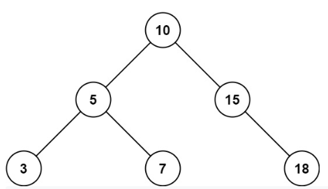
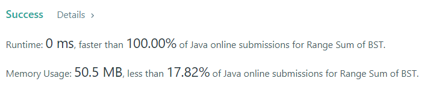

# Range Sum of BST

### Task:

    Given the root node of a binary search tree and two integers low and high, return the sum of values of all nodes 
    with a value in the inclusive range [low, high].

### Example 1:

    Input: root = [10,5,15,3,7,null,18], low = 7, high = 15
    Output: 32
    Explanation: Nodes 7, 10, and 15 are in the range [7, 15]. 7 + 10 + 15 = 32.

### Result: 
    
    The time complexity of this algorithm is O(N). And the same algorithm for memory.
